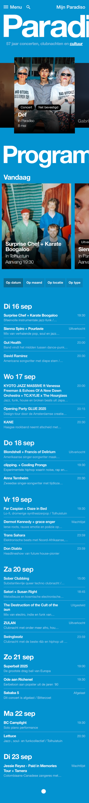
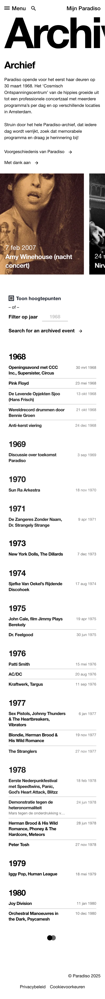

# Procesverslag

Procesverslag van Anouk Schaafsma, start-niveau: blauw en mijn focus: responsive.

## Informatie

Mijn gekozen website is Paradiso, ik heb deze website gekozen omdat ik het een mooi ontwerp vind en graag wilde leren hoe ik deze na kon maken. Op een beginners niveau. Hieronder zijn de afbeeldingen van de pagina's die ik heb nagemaakt.

Hier de link naar de website: https://www.paradiso.nl/

## Toegankelijkheidstest 1/2 (week 1)

### Bevindingen

Wat opviel aan de website van Paradiso is dat de code erg slordig is. Er komen veel foutmeldingen uit de validator. Je kan niet makkelijk met tap door de website heen omdat zij geen nette code hebben geschreven. Er wordt veel gebruik gemaakt van div en dit maakt het voor de screenreader ook een stuk moeilijker om er doorheen te gaan. Als je met tab door de website heen gaat is dat ook nauwelijks te zien omdat het blauw is en de eerste pagina van de website rood is. Op mobiel zijn de titels van de pagina's niet volledig zichtbaar, misschien is dit de bedoeling maar dat weet ik niet.

## Breakdownschetsen

Voor de breakdownschetsen heb ik gekeken naar de volledige pagina's, het menu en verschillende de carousels.

### Homepagina:

  

### Menu:

  

### Carousel 1 met opkomend programma:

  

### Carousel 2 met opkomend programma voor dag zelf:

  

### Opkomend programma in een lijst:

  

## Voortgang 1 (week 2)

### Stand van zaken

Ik heb niet vastgelegd wat ik hier had maar het was een redelijke basis. Sommige dingen heb ik mee kunnen nemen van vorig jaar.

### Agenda voor meeting

#### Daphne
Foto's en font downloaden

#### Leon:
Forms uitwerken en navigatiebar

#### Tobias:
Hover effect in een ul

#### Anouk:
Font inladen en carousel maken

### Verslag van meeting
- alle divs eruit halen, net als de classes en articles (tenzij je een goede reden hebt om ze te gerbuiken)
- voor de carousel de link op de h2 zetten
- bij alle images een alt text gebruiken

## Voortgang 2 (week 3)

### Stand van zaken

Ik had hier niet genoeg progres gemaakt met mijn css. Het gesprek was alsnog nuttig omdat iemand al was begonnen met een light-dark mode. Ik ben hierna er ook mee begonnen.

### Agenda voor meeting

#### Chiara:
Mov exporteren van de site en in code zetten
carrousel (met mov's)

#### Leon:
Het maken van een hamburger menu. (Kan ik daar uitkomen door de les terug te kijken van java script? sinds ik die gemist heb) Feedback op goed responsive maken van de website.

#### Tobias:
Carousel verbeteren, hamburger menu is wederom gebroken, nog een probleem met de nav bar

#### Daphne:
Weer probleem met github, moet ik bepaalde filmpjes toevoegen of is thumbnail genoeg
en hoe krijg ik de scrollbar weg en de puntjes omhoog

### Verslag van meeting

hier na afloop snel de uitkomsten van de meeting vastleggen

- meer proces maken, css vooruitgang was te weinig
- kijken of ik 1 nav tag ga gebruiken met veel ul, of meerdere
  nav tags ga gebruiken
- meerdere css bestanden gebruiken
- ik kan in de css :root gebruik maken van primitives (standaard kleuren) en die vervolgens gebruiken als font kleur of achtergrond kleur
- darkmode kan met @media (prefers-color-scheme:dark)

## Toegankelijkheidstest 2/2 (week 4)

### Bevindingen

Lijst met je bevindingen die in de test naar voren kwamen (geef ook aan wat er verbeterd is):

- ik probeer zo min mogelijk divs te gebruiken
- ik heb de kleuren en fonts in primitives gezet en die bij andere tags aangewezen.
- h tags op een logische manier gebruikt, werd eerst niet gedaan
- ol/ul items gebruikt voor lijsten.

## Voortgang 3 (week 4)

### Stand van zaken

Mijn voortgang was redelijk, kon zeker beter.

### Agenda voor meeting

samen met je groepje opstellen

#### Chiara:  
 mov exporteren van de site en in code zetten, carrousel (met mov's)

#### Leon:
Het maken van een hamburger menu. (Kan ik daar uitkomen door de les terug te kijken van java script? sinds ik die gemist heb), feedback op goed responsive maken van de website.

#### Tobias:
Carousel verbeteren,hamburger menu is wederom gebroken, nog een probleem met de nav bar

#### Daphne:
Weer probleem met github, moet ik bepaalde filmpjes toevoegen of is thumbnail genoeg en hoe krijg ik de scrollbar weg en de puntjes omhoog

#### Anouk:
Hoe ik mijn lege <a> tags een transitie kan geven en ook hoe ik een carousel met filmpjes maak.

### Verslag van meeting

Ik weet eigenlijk niet meer zo goed wat eruit kwam. Maar het was wel nuttig.

## Eindgesprek (week 5)

Ik vond dit vak soms leuk, als het lukte. Maar coderen is iets waar je echt je tijd voor moet nemen en ik houd daar niet zo van. Ik heb liever dat het snel af is. Ik heb het vak ook vaak voor mij uitgeschoven wat mij achteraf alleen maar ellende heeft opgeleverd maar ik vind dat het uiteindelijk een goed eindresultaat is geworden. Ik weet niet of ik in de toekomst nog veel ga coderen maar ik heb nu een betere basis dan vorig schooljaar.

Ik heb meer geleerd over responsive design. En snap nu ietsje beter hoe min-width werkt. Ook heb ik geleerd dat je best makkelijk een dark mode kan toevoegen aan je website.

Ook heb ik meer geleerd over css grid. Ik vind het nog steeds wel een beetje lastig, maar wat ik wilde voor mijn ontwerp is gelukt dus daar ben ik trots op.

Hieronder afbeeldingen om mijn verhaal te onderbouwen:

## Header, de h1 en de eerste carousel:

## Programma van de dag zelf en carousel:

## Programma van de dag zelf en carousel:

## Darkmode homescreen:

link van vorig jaar
https://anoukschaafsma2.github.io/FED-her-j2/index.html

## Bronnenlijst

Ik heb een aantal bronnen gebruikt om beter te kunnen begrijpen wat ik wilde doen op het gebied van flexbox en grid. Hiervoor heb ik de volgende websites gebruikt:

https://css-tricks.com/snippets/css/a-guide-to-flexbox/
https://css-tricks.com/snippets/css/complete-guide-grid/
https://www.cssgridplayground.com/?utm_source=chatgpt.com

Ik heb tijdens het coderen ook wel eens chat gpt gebruikt. Dit was grotendeels voor het doorlezen van mijn code om te kijken of ik ergens overheen keek.

Voor het maken van de carousels heb ik de volgende website gebruikt:

https://chrome.dev/carousel-configurator/

Ook heb ik een aantal h2 gebruikt om de hierarchie goed te laten lopen. Deze h2 hebben de class: visually-hidden. Hiervoor heb ik de volgende link gebruikt:

https://www.a11yproject.com/posts/how-to-hide-content/

